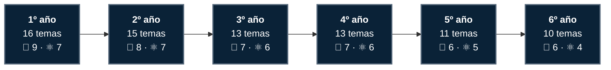
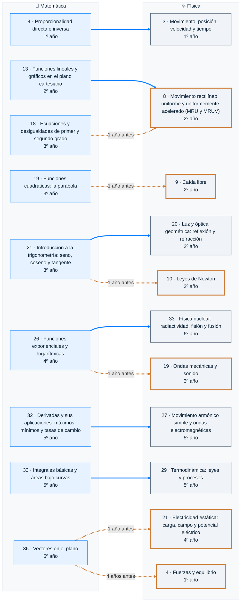
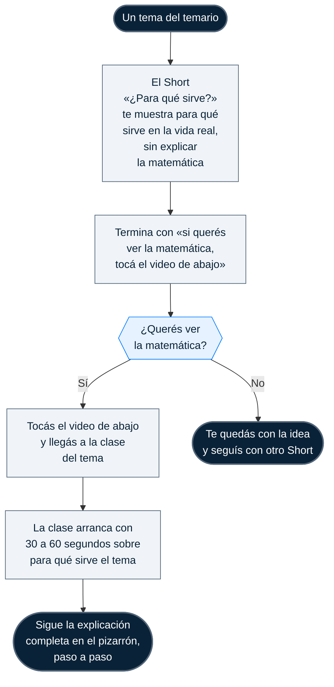
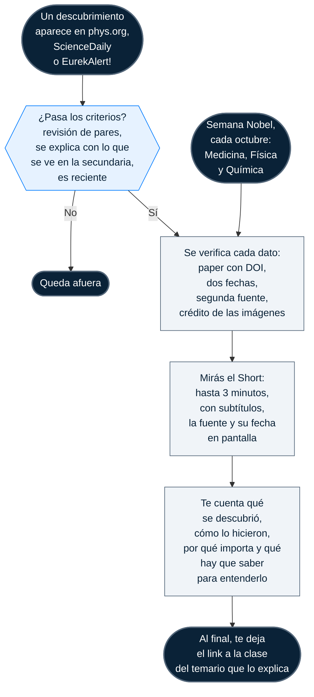

# 🗺️ Mapas

Cómo se ordenan los 78 temas, cómo se conectan Matemática y Física, y cómo te llevan los Shorts hasta cada clase. El temario completo, con filtros y búsqueda, está en la [página](https://loiaconobruno.github.io/loiaAcademy/#temario) y en [data/temario.csv](data/temario.csv). Volvé al [inicio](README.md).

- [Recorrido por año](#recorrido-por-año)
- [Conexiones entre Matemática y Física](#conexiones-entre-matemática-y-física)
- [Antes de estos temas, mirá la matemática que usan](#antes-de-estos-temas-mirá-la-matemática-que-usan)
- [Flujo del Short «¿Para qué sirve?»](#flujo-del-short-para-qué-sirve)
- [Flujo de «Recién descubierto»](#flujo-de-recién-descubierto)

## Recorrido por año

Los 78 temas, año por año: 43 de Matemática y 35 de Física.

Los temas de 6º de Matemática son de nivel preuniversitario: en la facultad se ven en Análisis II y Álgebra.

## Conexiones entre Matemática y Física

Cada flecha une un tema de Matemática con el tema de Física que lo usa. El número es el del temario.

- **Flecha azul:** a tiempo. Matemática lo enseña ese mismo año o antes.
- **Flecha naranja punteada:** desfasado. Física lo usa antes de que Matemática lo enseñe.
- **Borde naranja:** tema de Física que usa matemática de un año posterior.

## Antes de estos temas, mirá la matemática que usan

Seis temas de Física usan matemática que en el temario aparece en un año posterior. Si llegás a uno de ellos, conviene ver antes la clase de Matemática.

| Tema de Física | Usa este tema de Matemática | Que se ve |
|---|---|---|
| 4 · Fuerzas y equilibrio (1º) | 36 · Vectores en el plano (5º) | 4 años después |
| 8 · Movimiento rectilíneo uniforme y uniformemente acelerado (MRU y MRUV) (2º) | 18 · Ecuaciones y desigualdades de primer y segundo grado (3º) | 1 año después |
| 9 · Caída libre (2º) | 19 · Funciones cuadráticas: la parábola (3º) | 1 año después |
| 10 · Leyes de Newton (2º) | 21 · Introducción a la trigonometría: seno, coseno y tangente (3º) | 1 año después |
| 19 · Ondas mecánicas y sonido (3º) | 26 · Funciones exponenciales y logarítmicas (4º) | 1 año después |
| 21 · Electricidad estática: carga, campo y potencial eléctrico (4º) | 36 · Vectores en el plano (5º) | 1 año después |

## Flujo del Short «¿Para qué sirve?»

Un Short por cada tema del temario: muestra para qué sirve en la vida real y termina con «si querés ver la matemática, tocá el video de abajo». En el temario, **Para qué sirve** te adelanta de qué trata cada uno.

## Flujo de «Recién descubierto»

Cómo llega un descubrimiento a un Short, qué controles pasa antes y a qué clase del temario te lleva. Los criterios y la verificación, paso por paso, están en [shorts.md](shorts.md#recién-descubierto).

