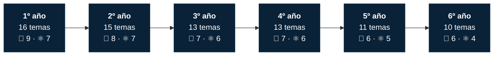
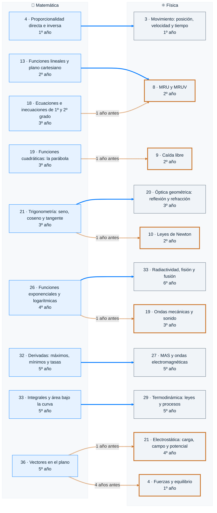
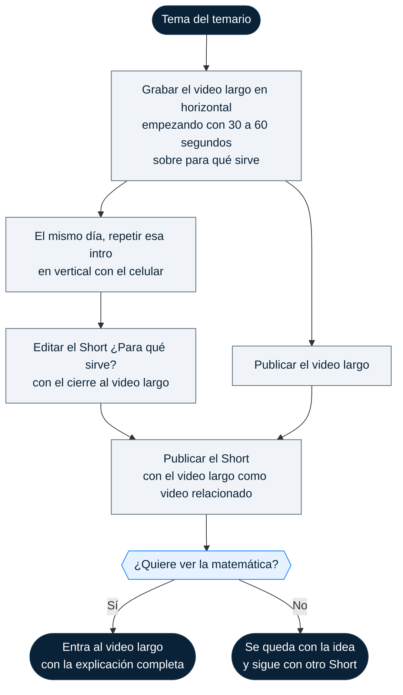
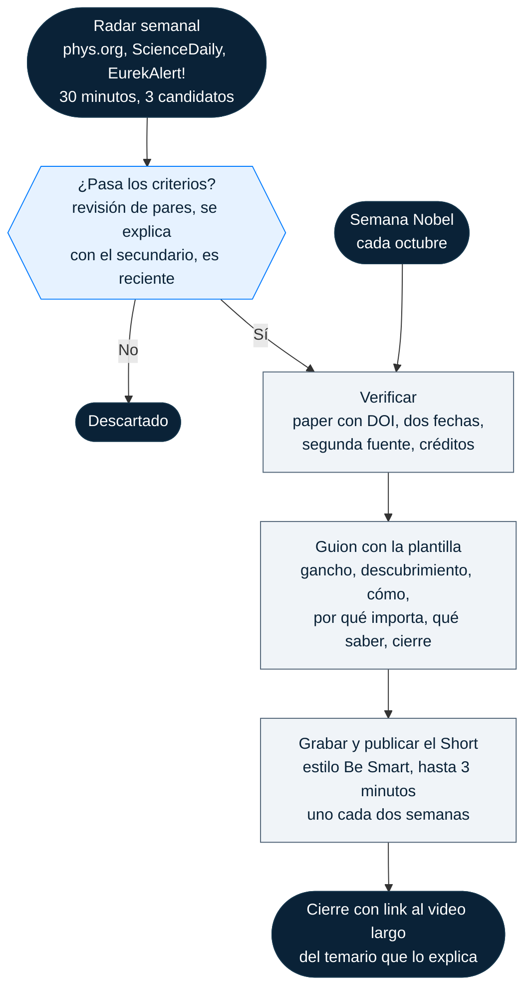

# 🗺️ Mapas

Cómo se ordenan los 78 temas, cómo se conectan Matemática y Física, y cómo nace cada Short. Volvé al [inicio](README.md).

- [Recorrido por año](#recorrido-por-año)
- [Conexiones entre Matemática y Física](#conexiones-entre-matemática-y-física)
- [Flujo del Short «¿Para qué sirve?»](#flujo-del-short-para-qué-sirve)
- [Flujo de «Recién descubierto»](#flujo-de-recién-descubierto)

## Recorrido por año

Los 78 temas, año por año: 43 de Matemática y 35 de Física. La lista completa está en el temario de [Matemática](temario/matematica.md) y de [Física](temario/fisica.md).

6º de Matemática ya es nivel preuniversitario: en la facultad esos temas se ven en Análisis II y Álgebra.

## Conexiones entre Matemática y Física

Cada flecha une un tema de Matemática con el tema de Física que lo usa. El número es el del temario.

- **Flecha azul:** a tiempo. Matemática lo enseña ese mismo año o antes.
- **Flecha naranja punteada:** desfasado. Física lo usa antes de que Matemática lo enseñe.
- **Borde naranja:** tema de Física que depende de un tema de Matemática posterior.

Seis temas de Física llegan antes que la matemática que necesitan. Si vas a ver uno de ellos, mirá primero la clase de Matemática: la lista está en el [temario de Física](temario/fisica.md#antes-de-estos-temas-mirá-la-matemática-que-usan).

## Flujo del Short «¿Para qué sirve?»

Un Short por cada tema del temario: muestra para qué sirve en la vida real y termina con «si querés ver la matemática, tocá el video de abajo». La idea de cada uno está en la columna **Para qué sirve** del temario.

## Flujo de «Recién descubierto»

Cómo un descubrimiento se convierte en un Short de loiaAcademy: del radar semanal al tema del temario que lo explica. Los criterios y la verificación, paso por paso, están en [shorts.md](shorts.md#recién-descubierto).

